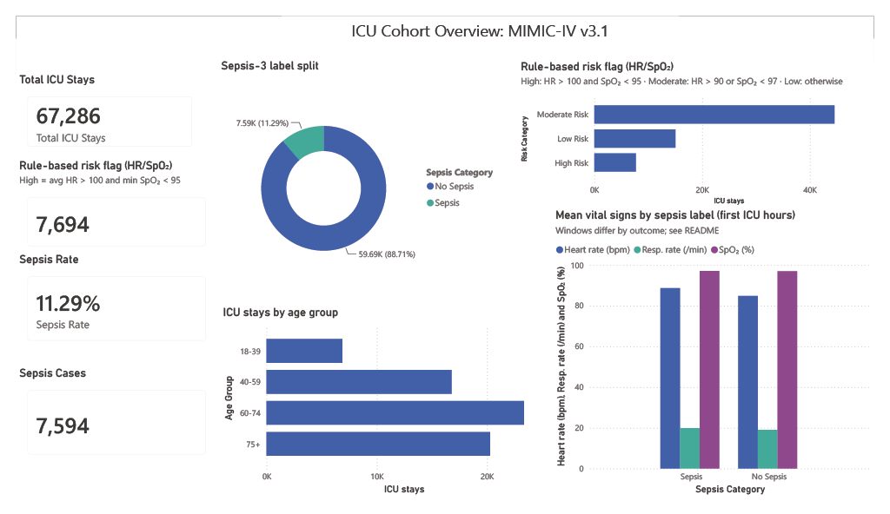
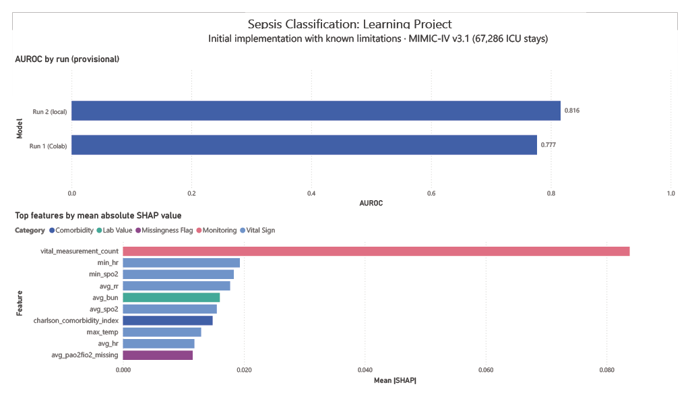

# MIMIC-IV Sepsis Classification: A Learning Project

> **About this project.** This is a self-directed learning project built with AI assistance. AI tools wrote most of the code; I ran the pipeline, checked intermediate outputs, and fixed data problems along the way. It is not peer reviewed and not clinically validated.

## Overview
A Random Forest classifier that separates adult ICU stays in MIMIC-IV with and without a Sepsis-3 label, using vital signs and labs from early in the stay. The intended design restricts features to data recorded before a treatment-related cutoff; the initial implementation has known limitations on this point (see "Known limitations"). The project was inspired by Kamran et al. (2024, *NEJM AI*). That study found that the Epic Sepsis Model's AUROC fell from 0.62 to 0.47 at the University of Michigan once predictions made after clinicians had already recognized sepsis were excluded.

The pipeline also writes example FHIR R4 RiskAssessment resources to practice health data interoperability formats.

---

## Context

Kamran et al. evaluated the Epic Sepsis Model on 77,582 hospitalizations at the University of Michigan (2018–2020). Overall AUROC was 0.62 (95% CI 0.61–0.63). Restricted to predictions made before treatment began, it was 0.47 (95% CI 0.46–0.48). Their point is that a sepsis model can look useful partly because it picks up clinicians' own actions. This project is an exercise in building a sepsis model on a different dataset with that restriction in mind.

---

## Results

| Run | AUROC | Status |
|---|---|---|
| Random Forest, run 1 (Google Colab) | 0.7766 | Initial implementation; known methodological limitations |
| Random Forest, run 2 (local machine) | 0.8160 | Initial implementation; known methodological limitations |

**How to read these numbers**
- **Not a comparison with Epic's model.** Kamran et al. used a different hospital, population, sepsis definition, prediction setup and evaluation method. The Epic figures above are context, not a head-to-head comparison.
- **The two runs disagree.** Two runs produced AUROC values of 0.7766 and 0.8160. The discrepancy remains unresolved, so these are provisional run outputs rather than a reproducible performance estimate. Data exports, patient splits, random seeds, preprocessing and software versions still need to be compared.
- **Internal test set only.** Both runs evaluate on MIMIC-IV patients. There is no external or prospective validation.

## Known limitations of the initial implementation

A retrospective review of the project record identified two problems affecting interpretation of the reported results:

- **Observation windows were constructed differently by outcome.** Sepsis cases were truncated at the derived suspected-infection timestamp, while non-sepsis cases could contribute the full six-hour window. This may allow the model to distinguish cases partly through differences in observation duration and measurement counts. Removing the measurement-count feature alone would not fix this, because window length also affects minimum, maximum, average and missingness features.
- **Median imputation was fitted before the train/test split,** allowing test-set information to influence preprocessing. Preprocessing should be fitted on training data only, then applied to validation and test data.

The reported AUROCs describe this initial implementation. They should not be interpreted as established early-prediction performance. The observation-window rules and preprocessing need to be corrected, followed by a new evaluation.

Additional unresolved questions include patient overlap between splits, feature availability at prediction time, handling of existing sepsis, and the difference between the two runs (see "Open questions").

## Open questions

Beyond the known limitations above, these need to be resolved before the results can support an early-prediction claim:

1. **Prediction time and horizon.** Define when each prediction is made and how far ahead it looks.
2. **Feature timing.** Confirm, record by record, that every feature was recorded before the prediction time.
3. **Cutoff for negative cases.** Define an equivalent cutoff for stays without a qualifying sepsis episode.
4. **Prevalent cases.** Decide how to handle patients who already meet the sepsis definition at the prediction time.
5. **Patient-level split.** Confirm that no patient appears in both training and test data. The test set holds 13,458 ICU stays, and some patients have more than one stay.
6. **Run discrepancy.** Find the source of the difference between the two AUROC values.

## Dashboard

### ICU Cohort Overview


The risk bands on this page come from a simple heart rate and SpO₂ rule, not from the model.

### Sepsis Classification: Learning Project

The risk bands in this dashboard are illustrative rule-based categories built from heart rate and oxygen saturation. They are not Random Forest predictions.

---

## What This Project Includes

### Prediction model
- Random Forest classifier (scikit-learn)
- **Cohort:** 67,286 adult ICU stays from MIMIC-IV v3.1 (Beth Israel Deaconess Medical Center, 2008–2022)
- **Features:** vital signs, early lab results, age and comorbidity index from the first 6 hours of the ICU stay, intended to be limited to data recorded before the candidate cutoff
- **Candidate treatment cutoff:** the extraction uses MIMIC-IV's derived suspected-infection timestamp. This timestamp is based on antibiotic–culture pairing rules and does not necessarily represent the first treatment-related action. The cutoff implementation and its handling of patients without a qualifying sepsis episode require further verification.
- **Outcome label:** Sepsis-3 labels from the MIMIC-IV derived tables

### Feature attribution check
- SHAP values were used to list the most influential features. No explicit treatment variables (antibiotics, blood cultures, IV fluids) appear among the top 20. This is not a timing check, and it does not address the observation-window problem described under "Known limitations".

### FHIR output
- Example JSON intended to follow the FHIR R4 RiskAssessment resource, with SNOMED CT coding and SHAP-based rationale text. Conformance has not been checked with a FHIR validator.
- The original output included a custom extension flag certifying pre-treatment status, set to true. That flag is not supported by the evidence and should be disregarded.
- This is a format exercise. It does not show that the predictions are clinically valid or ready for clinical use.

---

## Top Features by SHAP Value

| Rank | Feature | Meaning |
|---|---|---|
| 1 | vital_measurement_count | Number of vital-sign measurements (monitoring intensity) |
| 2 | min_hr | Minimum heart rate in the 6-hour window |
| 3 | min_spo2 | Minimum oxygen saturation |
| 4 | avg_rr | Average respiratory rate |
| 5 | avg_bun | Blood urea nitrogen (kidney function) |
| 6 | avg_spo2 | Average oxygen saturation |
| 7 | charlson_comorbidity_index | Chronic disease burden |
| 8 | max_temp | Maximum temperature |
| 9 | avg_hr | Average heart rate |
| 10 | avg_pao2fio2_missing | PaO₂/FiO₂ value missing from the extracted feature window |

**Limits of this check.** No explicit treatment variables appear in the top 20, but that does not rule out indirect signals of clinical concern. The most important feature, `vital_measurement_count`, is also affected by the unequal observation windows described above. For `avg_pao2fio2_missing`, missingness may reflect clinical testing decisions, incomplete measurements, or the extraction process; its meaning requires checking against the feature-generation code. A stricter check would also confirm, record by record, that every feature value was recorded before the cutoff time.

---

## Repository Structure

```
mimic-sepsis-ews/
├── data/
│   ├── raw/          # Raw MIMIC-IV extracts (not committed: covered by DUA)
│   └── processed/    # Cleaned cohort, feature matrices, model, FHIR bundle
├── notebooks/
│   ├── 01_cohort_definition.ipynb       # Data loading, imputation, train/test split
│   ├── 02_feature_engineering.ipynb     # Exploratory data analysis
│   ├── 03_model_training.ipynb          # Random Forest, AUROC, SHAP
│   └── 04_fhir_output.ipynb             # FHIR R4 RiskAssessment generation
├── src/                                 # Settings and documentation only; runnable code is in the notebooks
│   ├── cohort.py                        # Cohort definition notes
│   ├── features.py                      # Feature definition notes
│   ├── model.py                         # Model settings
│   ├── fhir_generator.py                # FHIR output notes
│   └── contamination_audit.py           # Feature attribution notes
└── README.md
```

---

## Running the Notebooks

The notebooks detect whether they are running in Google Colab or locally:

```python
if os.path.exists('/content/drive'):
    # Google Colab
    from google.colab import drive
    drive.mount('/content/drive')
    project_path = '/content/drive/MyDrive/mimic-sepsis-ews'
else:
    # Local
    project_path = os.path.abspath(os.path.join(os.getcwd(), '..'))
```

**Environments used**
- Google Colab (Python 3, scikit-learn version not recorded): AUROC 0.7766
- Local machine, Windows 11 (Python 3, scikit-learn 1.9.0): AUROC 0.8160

See "How to read these numbers" above for the open question about why these differ.

---

## Dataset

MIMIC-IV v3.1 (Medical Information Mart for Intensive Care)
- **Source:** Beth Israel Deaconess Medical Center, Boston MA (2008–2022)
- **Access:** PhysioNet Credentialed Health Data License
- **Size:** 67,286 adult ICU stays used in this project
- **Accessed via:** Google BigQuery (`physionet-data` project; MIMIC-IV v3.1 hosp and icu datasets plus derived concept tables. Exact dataset names are in the SQL queries.)

Raw data files are not included in this repository, in line with the PhysioNet Data Use Agreement.

---

## Requirements

```bash
pip install pandas numpy scikit-learn shap matplotlib seaborn jupyter
```

---

## References

- F. Kamran, D. Tjandra, A. Heiler, J. Virzi, K. Singh, J. E. King, T. S. Valley, and J. Wiens, "Evaluation of sepsis prediction models before onset of treatment," *NEJM AI*, vol. 1, no. 3, 2024, doi: 10.1056/AIoa2300032.
- M. Singer *et al.*, "The Third International Consensus Definitions for Sepsis and Septic Shock (Sepsis-3)," *JAMA*, vol. 315, no. 8, pp. 801–810, 2016.
- A. Johnson *et al.*, "MIMIC-IV (version 3.1)," PhysioNet, 2024, doi: 10.13026/kpb9-mt58.
- A. E. W. Johnson *et al.*, "MIMIC-IV, a freely accessible electronic health record dataset," *Sci. Data*, vol. 10, Art. no. 1, 2023, doi: 10.1038/s41597-022-01899-x.
- HL7 International, "FHIR R4 RiskAssessment Resource." [Online]. Available: https://hl7.org/fhir/R4/riskassessment.html

---

## Author

Shreyas Karnad
Master of Health Informatics, University of Michigan (2026)
[LinkedIn](https://linkedin.com/in/shreyas-karnad) | [Portfolio](https://karnadsp.github.io) | [GitHub](https://github.com/karnadsp)

## Status
Learning project. Initial modeling June 2026; the dashboard and local re-run followed later. The known limitations and open questions above are unresolved, and a corrected re-run is the next step. Not clinically validated.
